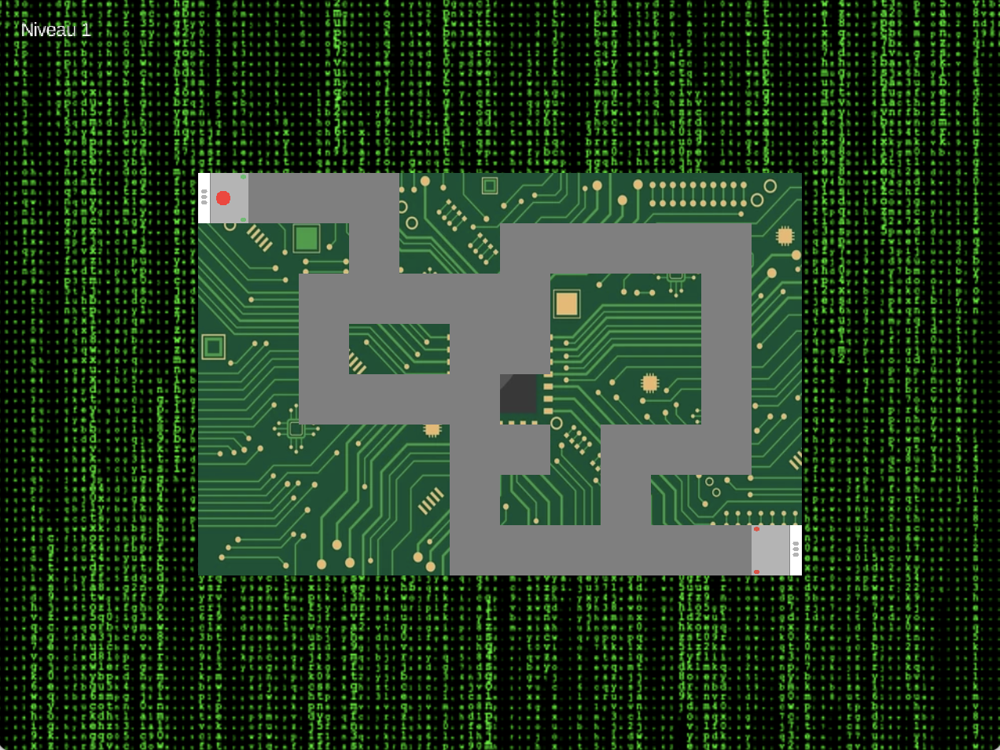

**Développement du Jeu "Circuit Laser" en Java (LibGDX)**

  

Ce projet a été réalisé dans le cadre du module de Programmation Orientée Objet (POO) du BUT Science des Données. L'objectif était de concevoir une application graphique interactive complète en respectant les principes de la conception logicielle.

**Description du Projet**

**Circuit Laser** est un jeu de réflexion et d'adresse. Le joueur doit guider un faisceau laser à travers un labyrinthe, du point de départ à la sortie, en évitant tout contact avec les murs ou les obstacles.

Les points clés du développement technique :

* **Architecture POO :** Utilisation du langage Java et du framework LibGDX. Le code est structuré pour séparer la gestion des états du jeu (écrans de menu, de jeu, de victoire/défaite) de la logique de rendu.
* **Système de Niveaux :** Conception de labyrinthes basés sur des matrices (tableaux 2D). Cette structure permet une détection de collision précise en convertissant les coordonnées de l'écran en indices matriciels.
* **Gestion de l'Affichage :** Implémentation d'une `OrthographicCamera` et d'un `FitViewport` pour assurer un affichage "responsive", conservant les proportions du jeu quel que soit le redimensionnement de la fenêtre.
* **Physique du Laser :** Calcul des déplacements et des trajectoires en temps réel avec une gestion fluide des entrées utilisateur.

**Contenu du dossier**

* **`circuit/`** : Dossier principal contenant les sources et les ressources du projet.
* **`javadoc/`** : Documentation technique générée automatiquement détaillant l'ensemble des classes et des méthodes du code source.
* **`CircuitLaser.jar`** : Version exécutable du jeu permettant de lancer l'application directement.
* **`Rapport.pdf`** : Rapport d'étude complet présentant les choix technologiques, l'architecture technique et les solutions apportées aux problématiques de développement.
* **`image_du_jeu`** : Screenshot du jeu

  

**Aperçu**

