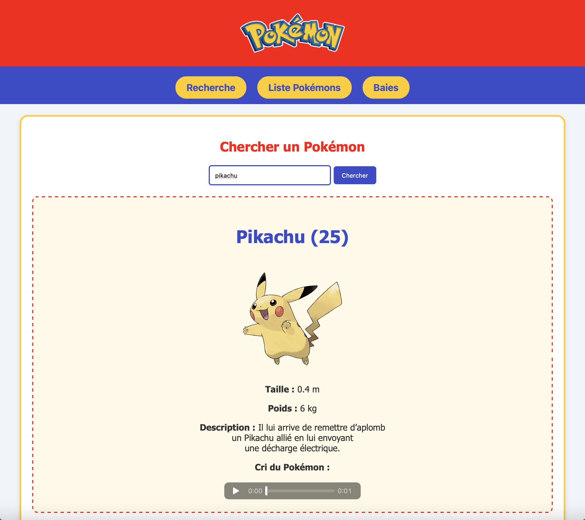

**Client PokéAPI**

  

Ce projet est une interface web interactive qui communique avec l'API publique **PokéAPI**. Il permet d'explorer l'univers Pokémon de manière fluide en récupérant et en affichant des données en temps réel.

Pour lancer le projet : 
Clique droit sur le fichier `index.html` puis sélectionnez **"Open with Live Server"**.

  

