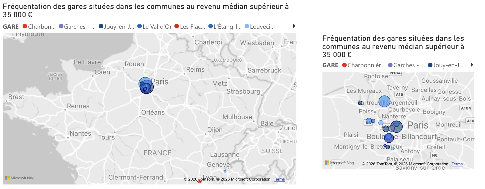

**Analyse de la Fréquentation des Gares SNCF (2015-2022)**

  

Ce projet a été réalisé dans le cadre de la SAE 2.06 du BUT Science des Données, avec pour objectif de mettre en pratique nos compétences en analyse de données, reporting et datavisualisation.

**Contexte et Travail Effectué**

Dans cette étude, nous nous sommes concentrés sur l'évolution de la fréquentation des gares françaises entre 2015 et 2022. À partir des objectifs de la SAE, notre travail a reposé sur l'exploration des données et la création de tableaux de bord interactifs avec Power BI pour visualiser l'impact de plusieurs variables sur la mobilité.

Notre analyse explore notamment l'influence des facteurs socio-économiques locaux, tels que le taux de chômage, le revenu médian et la densité de population active. Nous avons également mis en évidence l'impact du type de desserte ferroviaire (TER, TGV, Transilien, Intercités) sur les flux de voyageurs, tout en soulignant le rôle central de la région Île-de-France et les effets de la crise sanitaire.

**Le Jeu de Données**

Pour mener à bien ce projet, nous avons manipulé une base de données particulièrement riche et multidimensionnelle fournie par la SNCF. Ce jeu de données volumineux a nécessité un important travail d'appropriation. Il croise à la fois des séries temporelles sur les flux de voyageurs et les types de dessertes, avec une grande diversité d'indicateurs démographiques, fiscaux et socio-économiques à l'échelle communale. Un dictionnaire des données accompagne la base pour expliciter l'ensemble de ces variables.

**Contenu du dossier**

* `rapport.pdf` : Le document de synthèse présentant notre problématique, notre analyse et nos conclusions.
* `Présentation-Dataviz-2025.pdf` : Le support expliquant les objectifs du projet et les attendus en termes de datavisualisation.
* `JeuDeDonneesSNCF.csv` : La base de données brute exploitée pour nos analyses et nos tableaux de bord.
* `Dictionnaire.xlsx` (et sa version CSV) : Le descriptif détaillé de l'ensemble des variables du jeu de données.
* `PowerBi_SAE2.06.pbix` : Le tableau de bord interactif Power BI.
* Le dossier `screens` : Contient les différentes visualisations.

  

**Aperçu**

